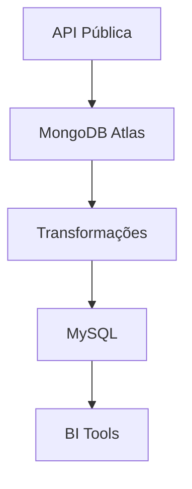
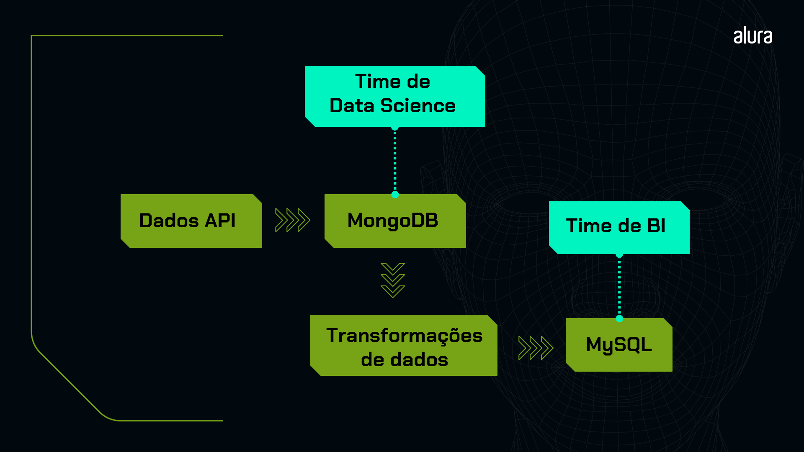

# 🚀 Pipeline de Dados: Da Coleta à Análise

 *(Ilustração de um pipeline de dados)*

## 📌 Visão Geral do Projeto
Projeto de pipeline de dados para extração, transformação e carregamento (ETL) de uma API pública, possibilitando análise de dados pelo time de BI.






---


# 🔍 Fontes de Dados  
## 🌐 API Pública  
Tipo: RESTful API  
Autenticação: OAuth 2.0 (quando necessário)  
Frequência de Atualização: Diária  

Exemplos de Dados:  
- Dados demográficos  
- Informações geográficas  
- Métricas de desempenho  

## ⚙️ Processamento de Dados  

### 🏗️ Fase 1: Extração e Armazenamento Inicial  
MongoDB Atlas (Data Lake)  
☁️ Solução na nuvem (alternativa ao WSL)  
🆓 Camada gratuita com limitações:  
- 512MB de armazenamento  
- Shared RAM  
- Operações limitadas  

🔄 Configuração:
```javascript
// Exemplo de conexão
const { MongoClient } = require('mongodb');
const uri = "mongodb+srv://<user>:<password>@cluster0.mongodb.net/<db>?retryWrites=true&w=majority";
const client = new MongoClient(uri);
```
### 🧠 Fase 2: Transformação  
Processos aplicados:  

🧹 Limpeza de dados:  
- Tratamento de valores nulos  
- Padronização de formatos  

🔄 Normalização:  
- Ajuste de timezones  
- Conversão de unidades  

✨ Enriquecimento:  
- Junção com datasets complementares  
- Cálculo de métricas derivadas  

Ferramentas:  
- Python (Pandas, PySpark)  
- JavaScript (para manipulação no MongoDB)  

### 🚚 Fase 3: Carregamento  
MySQL (Data Warehouse)  
🏷️ Esquema estrela para análise dimensional  
🔐 Controle de acesso por roles:  
- bi_read_only  
- data_engineer  

⚡ Otimizações:  
- Indexação estratégica  
- Particionamento por datas  

🛠️ Stack Tecnológica  

| Camada       | Tecnologias                  |
|--------------|------------------------------|
| Extração     | Python Requests, Scrapy      |
| Armazenamento| MongoDB Atlas                |
| Processamento| Pandas, PySpark, Airflow     |
| Destino      | MySQL 8.0                    |
| Visualização | Power BI, Metabase           |

⚠️ Considerações Importantes  
🔄 Orquestração: Recomenda-se usar Airflow ou Prefect para agendamento  
📊 Monitoramento: Implementar logs e alertas para cada estágio  
🔒 Segurança: Criptografar dados sensíveis em trânsito e em repouso  
💾 Backup: Política de backups diários para o MongoDB Atlas  

📅 Próximos Passos  
- Configurar ambiente de desenvolvimento  
- Implementar extração inicial  
- Criar transformações básicas  
- Estabelecer conexão com MySQL  
- Testar acesso do time de BI  

✨ Dica: Para ambientes de produção, considere serviços gerenciados como AWS Glue ou Google Dataflow para processamento em grande escala!
